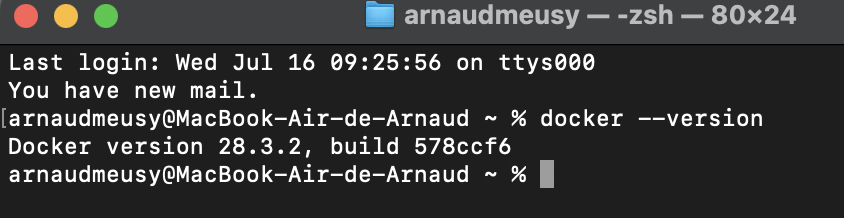
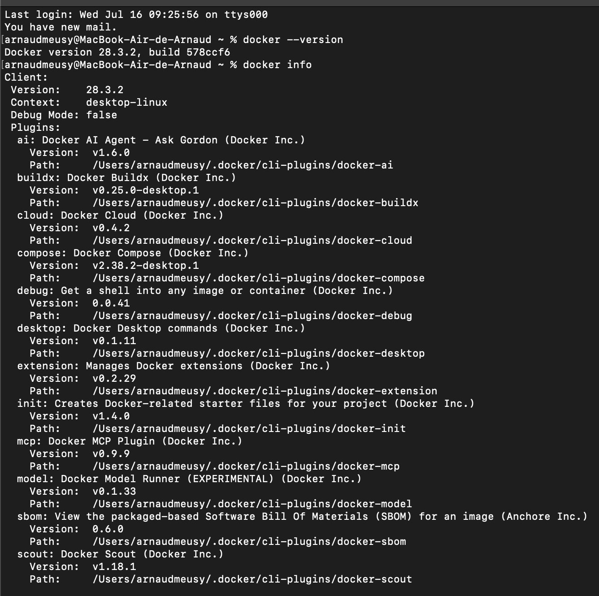
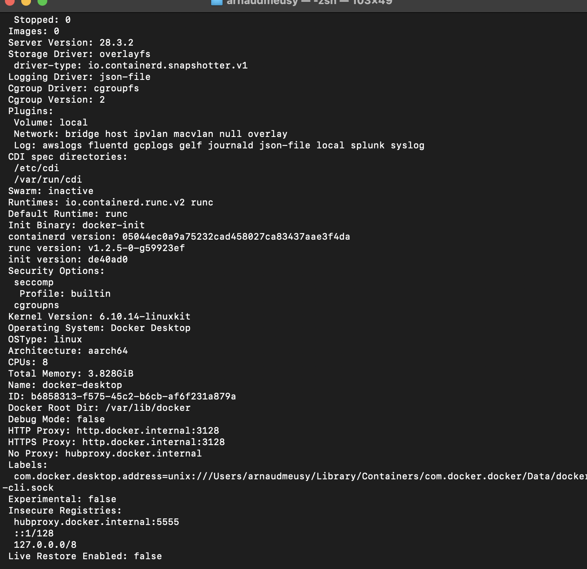
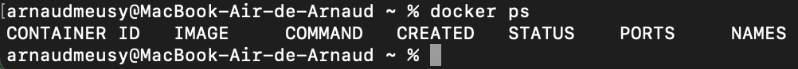
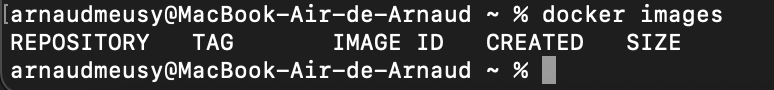

# 🐳 Job 01 - Docker : Mes premiers pas avec Docker

## 🎯 Objectifs du projet

Ce projet est une première introduction à Docker dans le cadre de la formation. Il a pour but de :

- Comprendre les bases de Docker
- Apprendre à installer, exécuter et interagir avec des **images** et **conteneurs Docker**
- Découvrir l’image officielle [`welcome-to-docker`](https://github.com/docker/welcome-to-docker)

---

## ✅ Étapes réalisées

### 1. Installation de Docker

- Docker Desktop a été installé avec succès sur mon ordinateur.

### 2. Création et connexion au compte Docker
- 

### 3. Vérifier la version d'installation de docker avec la commande
docker --version
- 

### 4. Tester les commandes de base dans le terminal :
docker info : affichage des informations système Docker avec docker info
- 
- 

docker ps : affichage des conteneurs en cours avec docker ps
- 

docker images : affichage des images Docker disponibles localement avec docker images
- 
