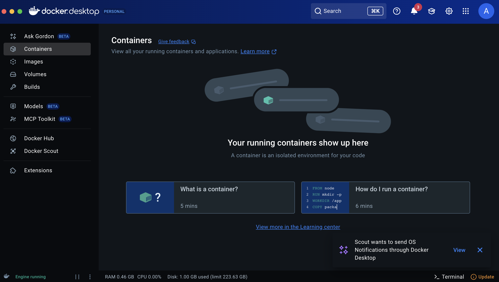

# 🐳 Job 01 - Docker : Mes premiers pas avec Docker

## 🎯 Objectifs du projet

Ce projet est une première introduction à Docker dans le cadre de la formation. Il a pour but de :

- Comprendre les bases de Docker
- Apprendre à installer, exécuter et interagir avec des **images** et **containers Docker**
- Découvrir l’image officielle [`welcome-to-docker`](https://github.com/docker/welcome-to-docker)

---

## ✅ Étapes réalisées

### 1. Installation de Docker

- Docker Desktop a été installé avec succès sur mon ordinateur.

### 2. Création et connexion au compte Docker
- 

### 3. Vérification de la version d'installation de docker avec la commande
docker --version
- 

### 4. Test des commandes de base dans le terminal :
👉 docker info : affichage des informations système Docker avec docker info
- 
- 

👉 docker ps : affichage des containers en cours avec docker ps
- 

👉 docker images : affichage des images Docker disponibles localement avec docker images
- 

👉 docker run : démarrer un container Docker à partir d’une image. Message d’erreur indiquant que la commande docker run nécessite au minimum un argument, qui est le nom de l’image Docker que je veux lancer.
- 

👉 docker stop : arrêter un container en cours d'exécution. Message d’erreur indiquant que la commande docker stop nécessite au minimum un argument, qui est le nom de l’image Docker en cours d'exécution.
- 

### 5. Récupération de l’image Docker
👉 docker pull docker/welcome-to-docker
- 

👉 docker images docker/welcome-to-docker : Vérification que l'image welcome-to-docker est bien présente
- 

### 6. Construction du container Docker
👉 docker run -it --rm -p 8080:80 docker/welcome-to-docker :  Lancement du container avec un port valide
- 

👉 http://localhost:8080/ : Lancement de l'application dans le navigateur
- 

### 7. Arrêt du container en cours
👉 Ctrl + C : 
- 

### 8. Suppression de container
👉 Avec l'utilisation de --rm, le container est automatiquement supprimé juste après l'avoir arrêté.
La commande docker ps montre que le container n'existe plus
- 

### 9. Suppression de l'image du container
👉 docker rmi docker/welcome-to-docker
- 

### 10. Exemples de ligne de commande pour supprimer : 
👉 Un container spécifique : docker rm <container_id>

👉 Plusieurs conteneurs : docker rm <container_id1> <container_id2> <container_id3>

👉 Tous les conteneurs arrêtés : docker container prune

👉 Forcer la suppression d'un conteneur actif : docker rm -f <container_id>

👉 Une image spécifique : docker rmi <image_id>

👉 Plusieurs images : docker rmi <image_id_1> <image_id_2> <image_id_3>

👉 Toutes les images inutilisées : docker image prune -a

👉 Toutes les images non utilisées : docker image prune -a

👉 Forcer la suppression d'une image : docker rmi -f <image_id>

